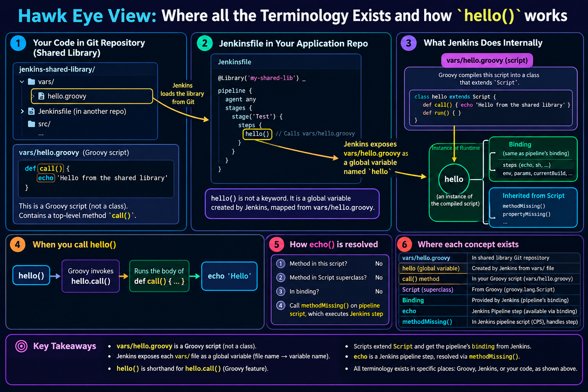

# Phase 2 — Your first step: `hello()`

> Correlates with: `groovy-learning/specs/07-first-shared-library.md` §§ *`vars/` rules*,
> *Loading a library*, *Registering the library*, *Break it on purpose*, and
> `java-maven-proj01/specs/08-pipeline-types-and-shared-library.md` § *Register the library in Jenkins*.

## Why

This is the phase where the abstraction becomes real: a file you write in this repo turns into a
keyword you can type inside `steps { }`. Everything else in the course is a variation on it.

It is also where beginners lose the most time — not on Groovy, but on Jenkins failing to find,
clone, or compile the library. So the step you write is deliberately trivial (one `echo`). When
something breaks, the code cannot be the suspect, and you are forced to learn to read the *real*
error. That is the actual skill this phase teaches.

> **Finding the Concepts section heavy going?** Read
> [02a — How `hello()` actually works (the slow version)](02a-how-hello-works-explained.md) first.
> It builds the same model from zero with more pictures and smaller steps, then sends you back here.
> Specific questions that came up along the way are answered in
> [02b — Questions and clarifications](02b-questions-and-clarifications.md).
> What happens when a step is *not* found, and how to inspect your own Jenkins' step
> registry, is in [02c](02c-step-registry-and-missing-steps.md).

## Concepts to understand first

### The whole phase in one picture



Everything below is this diagram, unpacked one box at a time:

| Box | Unpacked in |
|---|---|
| 1 — your code in the library repo | §1, and Phase 1's layout |
| 2 — the Jenkinsfile that calls it | §3, `@Library` and the `_` |
| 3 — what Jenkins does internally (`class hello extends Script`, the binding) | §2, steps 1–3 |
| 4 — `hello()` → `hello.call()` | §1 |
| 5 — how `echo` is resolved, down to `methodMissing` | §2, step 4 |
| 6 — where each concept lives | the Glossary in [00-overview.md](00-overview.md) |

Two naming differences between the diagram and this repo, so they do not trip you up:

* The diagram writes `@Library('my-shared-lib')`; this course registers the library as
  **`shared-lib`**.
* The diagram's step is `hello()` from `vars/hello.groovy`; the file you actually write is
  `vars/helloP2.groovy`, so the step is `helloP2()` — the `P2` is this repo's one-version-per-phase
  convention, nothing more.

### 1. How `hello()` reaches `vars/hello.groovy`

```
Jenkinsfile:  hello()
                 │
                 │  Jenkins exposes each vars/ file as a global variable named after the file
                 ▼
          hello   ──►  an instance of the compiled vars/hello.groovy script
                 │
                 │  Groovy: using any object like a function calls its call() method
                 ▼
          hello.call()   ──►  runs the body of  def call() { ... }
```

Two separate mechanisms meeting in the middle:

* **Jenkins' half:** file name → global variable name. `vars/hello.groovy` → `hello`.
* **Groovy's half:** `x()` is shorthand for `x.call()`. This is plain Groovy, nothing to do with
  Jenkins — any Groovy object with a `call()` method can be invoked like a function.

So `call()` is not a magic Jenkins name. It is the one method Groovy invokes when you use the
variable as if it were a function. A method named anything else is still reachable, just explicitly:
`hello.goodbye()` (Phase 3).

### 2. A `vars/` file is a script, not a class

Do not write `class Hello { ... }` in `vars/hello.groovy`. These files are Groovy **scripts** —
`def call() { }` at the top level, no wrapping class. Jenkins compiles the script and, crucially,
binds it to the running pipeline. That is what makes this work:

```groovy
def call() {
    echo 'Hello from the shared library'
}
```

`echo` is not defined anywhere in your file. You did not import it, you did not declare it, and
there is no `Jenkins.echo(...)` being called. Yet it works. Here is exactly why.

#### Why `echo` resolves — step by step

**Step 1: every Groovy script becomes a class that extends `Script`.**
This is plain Groovy, nothing to do with Jenkins. When Groovy compiles a *script* (a file with code
or method definitions at the top level, no `class` keyword), it generates a class extending
`groovy.lang.Script`, moves your top-level methods into it, and wraps any loose statements in a
`run()` method. So your three-line file secretly becomes something like:

```groovy
class hello extends Script {          // generated for you — you never see this
    def call() { echo 'Hello from the shared library' }
    def run() { }
}
```

**Step 2: every `Script` carries a `Binding` — a bag of names it can see.**

> New to the word *binding*? It is unpacked slowly, with a runnable plain-Groovy example, in
> [02a section 9](02a-how-hello-works-explained.md#9-what-is-a-binding).

A `Binding` is a Map of name → value that the script consults for any name it cannot resolve on its
own. Normally it is empty. Jenkins does not leave it empty.

**Step 3: Jenkins hands your script the *pipeline's* binding, not a fresh one.**
When your build runs and the library is loaded, Jenkins instantiates `hello` and sets its binding to
the binding of the currently running pipeline script — the same object your `Jenkinsfile` code uses.
Your script is now, for practical purposes, standing inside the pipeline.

**Step 4: unresolved calls fall through to the pipeline script, which turns them into steps.**
Groovy resolves the call `echo 'Hello'` in this order:

```
  echo 'Hello'
      │
      ├─ a method named echo in this script?           no
      ├─ a method on the superclass (Script)?          no
      ├─ something in the binding named echo?          no
      │
      └─ nothing found → Groovy calls methodMissing()  ← the escape hatch
                  │
                  ▼
         Jenkins' pipeline script (CpsScript) implements methodMissing:
         "look up 'echo' in the registry of installed pipeline steps"
                  │
                  ▼
         found — the echo step, provided by the Pipeline Basic Steps plugin
                  │
                  ▼
         runs it, with 'Hello' as its argument
```

`methodMissing` is a standard Groovy hook: a class can implement it to intercept calls to methods
that do not exist. If Jenkins finds no matching step either, the build
fails with `No such DSL method 'x' found among steps` — traced in full in
[02c Q1](02c-step-registry-and-missing-steps.md). Jenkins' pipeline script implements it as "treat the unknown method name as a
pipeline step." That single hook is what makes `echo`, `sh`, `junit`, `archiveArtifacts`,
`withCredentials` and every plugin-provided step usable without importing anything.

The same applies to **properties**, via the matching `propertyMissing` hook — which is why `env`,
`params` and `currentBuild` are readable in your file with no setup.

#### The practical consequence

Inside a `vars/` script, `this` is effectively the running pipeline. These are equivalent:

```groovy
def call() {
    echo 'hi'            // resolved via methodMissing, as traced above
    this.echo('hi')      // the same thing, written out
}
```

So anything you can write in a `Jenkinsfile`'s `steps { }` block, you can write here — unqualified.

#### The flip side, so you are not surprised later

This convenience comes from your file being a **script with the pipeline's binding**. A file that is
a real class — `class Greeter { ... }`, the style used in `src/` — gets none of it. A normal class
is not a `Script`, has no `Binding`, and does not inherit Jenkins' `methodMissing`. Write `echo 'hi'`
inside such a class and it fails at runtime with `No such property: echo` or a missing-method error,
because there is genuinely nothing there to resolve it against.

The fix, when you get there, is to pass the pipeline script into the class by hand:

```groovy
class Greeter {
    def script                             // a handle on the pipeline
    Greeter(script) { this.script = script }
    def greet(name) { script.echo "Hello ${name}" }   // now echo resolves — on script
}
```

and construct it from a `vars/` file with `new Greeter(this)` — `this` being the pipeline script,
exactly as traced above. Same mechanism, made explicit because the class cannot get it for free.

#### One more property of `vars/` scripts

A `vars/` script is instantiated **once per build**. Fields hold state for that build only, and two
concurrent builds get two separate instances. Don't lean on it for anything beyond simple caching
within a single run.

### 3. `@Library('shared-lib') _` — three things in eight characters

```groovy
@Library('shared-lib') _
```

* **`@Library(...)`** — an annotation Jenkins processes *before* your pipeline is parsed. It tells
  Jenkins: clone this library and put its `vars/` on the table.
* **`'shared-lib'`** — the **name you registered in Jenkins**, not the repo name, not the GitHub URL.
  They happen to be similar here; they are not the same thing. Add `@main`, `@v1` or a commit SHA to
  pin a version; with no `@`, you get the *Default version* from the Jenkins config.
* **`_`** — a Groovy annotation must be attached to something (a class, a method, a field…). When
  you are not importing anything, there is nothing to attach it to, so you write `_` — a legal, ugly,
  throwaway variable name whose only job is to give the annotation a target.

The `@Library` line must be the **first thing in the file**, above `pipeline {`.

### 4. Global Pipeline Libraries — what the UI fields mean

**Manage Jenkins → System → Global Pipeline Libraries → Add.** (Wording varies by Jenkins version;
you may also see *Global Trusted Pipeline Libraries*. For local learning, either is fine.)

| Field | Value | What it actually controls |
|---|---|---|
| **Name** | `shared-lib` | The string inside `@Library('…')`. Rename it and every Jenkinsfile breaks |
| **Default version** | `main` | What Jenkins checks out when a Jenkinsfile doesn't pin one. Branch, tag or SHA |
| **Allow default version to be overridden** | checked | Lets a Jenkinsfile say `@Library('shared-lib@v1')`. Phase 8 needs this |
| **Load implicitly** | **unchecked** | If checked, every job gets the library with no `@Library` line. Convenient, but then a Jenkinsfile no longer shows its own dependencies — keep it off |
| **Retrieval method** | Modern SCM → Git | How Jenkins fetches it |
| **Project Repository** | `https://github.com/prakashsingh08/jenkins-shared-library.git` | The URL **Jenkins** clones. Independent of your local `git remote` |
| **Credentials** | none if the repo is public | If you made it private in Phase 1, add credentials here |

> **Why "Trusted" matters:** a global library runs **outside the Groovy sandbox** — it can do things
> a Jenkinsfile alone cannot. That is the power, and the reason push access to a library repo is a
> security control in a real organisation.

### 5. The feedback loop, and why it feels slow

```
edit vars/hello.groovy  →  git commit  →  git push  →  Build Now  →  read console output
```

There is no shortcut at this stage, and pushing is not optional — see Phase 1. Jenkins caches
nothing between builds; every build re-clones. If the log shows old behaviour, you almost always
forgot to push. (Phase 8 introduces **Replay**, which lets you edit library code for a single run
without committing. Deliberately not used yet — the loop has to become instinct first.)

## Requirements

### 1. Write the step

Create `vars/hello.groovy`: a single `call()` method whose body is one `echo` printing a greeting of
your choice. Three lines, no imports, no `class`, no `return`.

Commit and push it. (If it is not on GitHub, it does not exist.)

### 2. Register the library

Work through the field table in Concepts §4.

**First, check whether it is already there** — an earlier attempt at
`java-maven-proj01/specs/08-…` may have created a `shared-lib` entry. If one exists, don't add a
second: open it and verify every field against the table. Two libraries with the same name is a
confusing failure mode you do not want to debug.

Save, and re-open the page to confirm the settings actually persisted.

### 3. Create a consumer job

**New Item → Pipeline**, name it `hello-library-demo`. In the **Pipeline** section choose
*Pipeline script* (not *from SCM*) so you can edit it in the browser while learning.

The script is:

* the `@Library('shared-lib') _` line, first,
* a minimal declarative pipeline — `agent any`, one `stage`, one step: `hello()`.

You have written declarative pipelines in `java-maven-proj01`; write this one from memory rather
than copying. It is four lines shorter than anything you have done there.

Build it.

### 4. Read the console output properly

Do not just check for green. Find and understand these lines:

* `Loading library shared-lib@main` — the clone happened. Note the version it resolved.
* The Git fetch lines beneath it, ending in a commit SHA — **compare that SHA to your latest
  commit** (`git log -1 --format=%H`). If they differ, you are testing code you didn't push.
* Your own greeting.

Then, a question to answer from the log: did the library clone happen **before or after** the
`agent any` node was allocated? What does that tell you about when library code is available?

### 5. Break it on purpose (the real exercise)

Do these **one at a time**, restoring between each. For every one, write down the *first* error line
and which part of the machinery it came from — the clone, the compile, or your pipeline.

1. **Wrong file name.** Rename to `Hello.groovy`, keep calling `hello()`. Push, build.
2. **Syntax error.** Delete a closing brace in `hello.groovy`. Push, build. Note that the failure
   happens before any stage runs — the compile is of the whole library.
3. **Missing `@Library`.** Remove the annotation line, keep `hello()`.
4. **Nonexistent version.** `@Library('shared-lib@nope') _`.
5. **Wrong library name.** `@Library('sharedlib') _`.

Now you have five error messages. Keep the notes — Phase 8 turns them into your troubleshooting
cheat-sheet, and #1 and #3 are the ones you will actually hit again in real work.

### 6. Answer Phase 1's predictions

Go back to the four *Predict, then check* questions from Phase 1. You now have evidence for all four.
Were you right? Where you were wrong, name the mechanism that surprised you.

## Done when

- [ ] `hello-library-demo` builds green and prints your greeting from the library.
- [ ] You found `Loading library shared-lib@main` in the log and matched its SHA to your last commit.
- [ ] You can explain, without notes: what `call()` is, why `_` is there, and why `echo` works inside
      `vars/hello.groovy` with no import.
- [ ] You triggered all five deliberate failures and can map each message to its cause.
- [ ] `Load implicitly` is unchecked, and you can say why that is the better default.

## Troubleshooting

| Symptom | Likely cause |
|---|---|
| `No such DSL method 'hello'` | The `@Library` line is missing, the library failed to load, or the file name doesn't match the call (case-sensitive) |
| `No library named shared-lib found` | The Name field in Jenkins doesn't match the string in `@Library(...)` |
| `Could not resolve shared-lib@main` / `Couldn't find any revision to build` | Branch name wrong, nothing pushed, or Jenkins is pointed at the wrong repo URL |
| `Authentication failed` in the clone step | Private repo with no credential configured in the library's SCM settings |
| Old behaviour after an edit | Not pushed, or you pushed to a branch other than the Default version |
| `expecting '}', found ''` and no stages ran | Compile error somewhere in `vars/` — not necessarily the file you called |

## Interview angle

* "How does `hello()` in a Jenkinsfile reach a file in a Git repo?"
* "What is the `_` in `@Library('x') _`?"
* "Why does a shared library run outside the sandbox, and why does that matter?"
* "A teammate pushed a broken file to the library's `main`. What happens to the other 200 pipelines,
  and how would you have prevented it?"

## Connects to

**Phase 3** gives steps arguments (`greet('Prakash')`), adds a second method in the same file
(`buildApp.cleanup()`), and documents a step with a `.txt` file that shows up in Jenkins' own UI.
