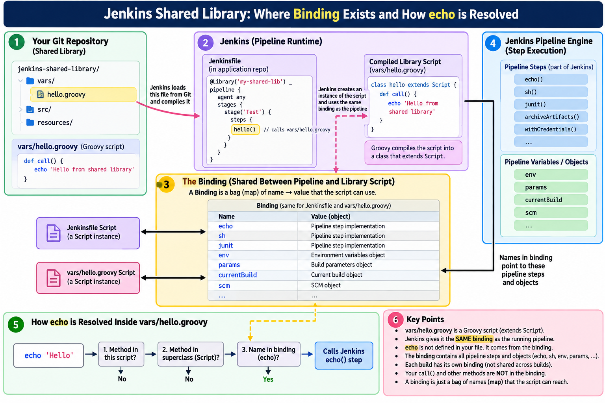

# Phase 2a — How `hello()` actually works (the slow version)

> **Supporting doc for [Phase 2](02-first-step-hello.md).** Phase 2's Concepts §1 and §2 say the same
> things in half a page. If that half page felt dense, read this first and then go back — it builds
> the same model from zero, one small idea at a time.
>
> Nothing here is extra work. There is no exercise, no checklist. Just the picture.

The whole phase rests on one sentence:

> Jenkins maps the **filename** `hello.groovy` to the name `hello`, and Groovy makes `hello()` call
> that object's `call()` method.

Two different mechanisms, from two different places, meeting in the middle. Most beginner confusion
is really the two being mistaken for one. So we take them apart.

---

## 1. First, forget Jenkins for two minutes

Plain Groovy. An ordinary object:

```groovy
class Calculator {

    def add() {
        return 10 + 20
    }
}

def calculator = new Calculator()
```

You call it the normal way:

```groovy
calculator.add()
```

Because:

```text
calculator
    ↓
object
    ↓
add()
```

Nothing surprising.

---

## 2. Groovy has one special convenience

Now give an object a method named exactly `call`:

```groovy
class Greeter {

    def call() {
        return "Hello"
    }
}

def greeter = new Greeter()
```

You *could* write the normal thing:

```groovy
greeter.call()
```

But Groovy offers a shortcut — use the object as if it were a function:

```groovy
greeter()
```

These two are equivalent:

```groovy
greeter()
greeter.call()
```

```text
greeter()
   ↓
Groovy sees an object being "called"
   ↓
looks for a method named call()
   ↓
greeter.call()
```

**This is plain Groovy.** No Jenkins involved. Any Groovy object with a `call()` method can be
invoked like a function. That tiny rule is the key to the whole of `vars/`.

---

## 3. Now bring Jenkins in

Your library:

```text
jenkins-shared-library/
│
└── vars/
    └── hello.groovy
```

and inside `hello.groovy`:

```groovy
def call() {
    echo 'Hello from the shared library'
}
```

Notice what is *missing*. There is no:

```groovy
class Hello {
}
```

That is deliberate. A file inside `vars/` is a **Groovy script**, not a normal class. Methods sit at
the top level, with nothing wrapped around them.

---

## 4. How does `hello()` find `hello.groovy`? — the Jenkins half

This part is Jenkins' job, and it is pure convention.

Jenkins sees:

```text
vars/hello.groovy
```

and exposes it to your Jenkinsfile under the name:

```text
hello
```

```text
Jenkinsfile
     │
     │ hello()
     ↓
Jenkins looks in the shared library
     │
     │ finds
     ↓
vars/hello.groovy
```

The filename *becomes* the name you type:

```text
vars/hello.groovy     → hello
vars/buildApp.groovy  → buildApp
vars/deploy.groovy    → deploy
```

That is the **Jenkins half** of the story, and it is the whole of it. Jenkins does not care what is
inside the file yet — it just makes the name available.

---

## 5. Now the Groovy half

Jenkins has handed you an object representing that file:

```text
hello
  ↓
an object created from hello.groovy
```

Then you wrote:

```groovy
hello()
```

Groovy reads that and thinks:

> "You're using this object as if it were a function."

So Groovy looks for:

```groovy
call()
```

Which means:

```groovy
hello()
```

is really:

```groovy
hello.call()
```

and therefore this runs:

```groovy
def call() {
    echo 'Hello from the shared library'
}
```

**This is why the method must be named `call`.** Not because Jenkins demands it — because Groovy's
"call an object like a function" rule looks for that exact name.

> *"But what if the object has several methods — how does Groovy pick?"* It doesn't pick: `()`
> always targets `call`, and other methods are reached by name. Worked through in
> [02b, Q1](02b-questions-and-clarifications.md#q1-if-greeter-has-several-methods-how-does-greeter-decide-which-one-runs).

---

## 6. The complete picture

```text
                    Jenkinsfile
                        │
                     hello()
                        │
                        ▼
              Jenkins Shared Library
                        │
                        │ filename
                        ▼
                 vars/hello.groovy
                        │
                        │ Jenkins creates an object
                        ▼
                   hello  (object)
                        │
                        │ Groovy sees ()
                        ▼
                    hello.call()
                        │
                        ▼
                 def call() {
                     echo "Hello"
                 }
                        │
                        ▼
                  the Jenkins echo step
```

Two separate mechanisms:

```text
Jenkins:                  Groovy:
vars/hello.groovy         hello()
       ↓                        ↓
     hello                hello.call()
```

Hold those apart in your head and the rest of the course gets easier.

---

## 7. The next question: where did `echo` come from?

Look again:

```groovy
def call() {
    echo 'Hello from the shared library'
}
```

You never wrote any of these:

```groovy
import echo
def echo() { }
Jenkins.echo()
```

And yet `echo 'Hello'` works. This is where the Pipeline machinery starts.

---

## 8. In normal Groovy, this would fail

```groovy
class Person {

    def greet() {
        hello()          // where is hello() defined?
    }
}
```

There is no `hello()` anywhere, so this blows up at runtime.

But a `vars/` script is not floating in space. Jenkins connects it to the **running Pipeline** by
giving it the Pipeline's *binding*, so names can be resolved against the live build.

---

## 9. What is a "binding"?

Ignore the intimidating word for a moment.

> **Binding = a bag of named things a script can reach.**

That is the whole idea. The rest of this section is just showing you the bag.



Sections 9 and 10 are this picture, taken slowly:

| Box | Where it is explained |
|---|---|
| 1 — your library file in Git | section 3 |
| 2 — Jenkins compiles it into a `class … extends Script` | section 8, and Phase 2 Concepts §2 |
| 3 — **the binding, shared between the Jenkinsfile and your library script** | 9.2 – 9.4 |
| 4 — the steps and objects the names point at | 9.4 |
| 5 — how `echo` is resolved, step by step | section 10 |
| 6 — key points | 9.5 and 9.6 |

**One honest correction to the diagram.** Box 5 shows `echo` being found at "name in binding?".
That is a fair simplification, and it is how it *behaves* — but the precise path for a **step** is
the `methodMissing` hook in section 10: the name is not literally sitting in the binding, Jenkins
intercepts the failed lookup and matches it against its registry of installed steps. The things that
genuinely are reached through the binding are the **objects** — `env`, `params`, `currentBuild`,
`scm`.

Keep the diagram's version for everyday reasoning; reach for section 10's when an error message
mentions `methodMissing` and you need to know why.

### 9.1 Where names normally come from

When Groovy runs a line like:

```groovy
echo 'Hello'
```

it has to work out what `echo` means. Normally there are only two places it can look:

```text
echo 'Hello'
   │
   ├── is `echo` defined in this file?          (a method you wrote)
   └── is `echo` defined in a parent class?     (something you extended)
```

If neither, it is an error. In an ordinary Groovy file you would have to write the method yourself,
or import it from somewhere.

### 9.2 A script has a third place: its binding

A Groovy **script** — remember section 3, a file with methods at the top level and no `class` — gets
one extra thing that a normal class does not: a `Binding` object attached to it.

Think of it as a labelled box that travels with the script:

```text
   your script                    its binding (a box of names)
   ───────────                    ────────────────────────────
   def call() {                   ┌───────────────────────┐
       echo 'Hello'   ──────────► │  name      → value    │
   }                              │  ─────────────────    │
                                  │  (empty by default)   │
                                  └───────────────────────┘
```

In plain Groovy, that box is **empty**, so nothing changes — `echo` still fails.

### 9.3 A tiny example, outside Jenkins

This is ordinary Groovy, nothing to do with Jenkins. It shows a binding being filled by hand:

```groovy
def binding = new Binding()
binding.setVariable('greeting', 'Hello')     // put a name in the box

def shell = new GroovyShell(binding)
shell.evaluate("println greeting")           // the script finds it → prints Hello
```

The script never declares `greeting`. It works because the name was in the binding when the script
ran. **That is the entire mechanism Jenkins uses** — it just fills a much bigger box.

### 9.4 What Jenkins puts in the box

When your pipeline runs, Jenkins builds a binding and fills it with everything a pipeline can use:

```text
the pipeline's binding
│
├── echo                ← steps
├── sh
├── junit
├── archiveArtifacts
├── withCredentials
│
├── env                 ← values
├── params
├── currentBuild
└── scm
```

And here is the part that matters:

> When Jenkins loads your `vars/` file, it does **not** give it a fresh empty binding. It gives it
> **the same binding the running pipeline is using.**

```text
Jenkinsfile (the pipeline script)        vars/helloP2.groovy
        │                                        │
        └──────────────┬─────────────────────────┘
                       ▼
            ONE shared binding
            echo, sh, env, params, currentBuild …
```

Your library file is plugged into the pipeline's own box of names. That is why it can use `echo`
without importing anything — and it is the single fact this whole document is building towards.

### 9.5 Two things a binding is not

* **It is not a list of your methods.** Your own `call()` and `cleanup()` are methods on the script;
  they are found the normal way, not through the binding.
* **It is not permanent storage.** The binding belongs to one build. Two builds have two bindings,
  and nothing you put in one is visible to the other. (Section 11 in Phase 2's spec makes the same
  point about `vars/` scripts being created once per build.)

### 9.6 Why the word exists at all

"Binding" is just the programming term for *tying a name to a value*. When you write
`def x = 5`, you are binding the name `x` to the value `5`. Groovy's `Binding` object is a bag of
exactly those name→value ties, kept outside the script so that whoever starts the script can decide
what goes in it.

Jenkins is the one who starts your script. So Jenkins decides what is in the bag — which is how a
file you wrote ends up able to call steps you never defined.

> **One sentence to keep:** a binding is a box of names that comes with a script, and Jenkins hands
> your library file the *pipeline's* box instead of an empty one.

### 9.7 You already saw it in the tests

In Phase 11 the test for `buildAppP4` contains this line:

```groovy
binding.setVariable('env', [BUILD_NUMBER: '1', JOB_NAME: 'test-job'])
```

That is a test filling the box by hand, exactly like the `GroovyShell` example in 9.3 — because
there is no real Jenkins around to do it. Seeing the same mechanism used deliberately in a test is
usually the moment it stops feeling like magic.

---

## 10. So why can `vars/hello.groovy` use `echo`?

Groovy sees:

```groovy
echo "Hello"
```

and asks: *where is `echo`?* It checks the script, the superclass, the binding… and finds nothing.

Normally that is an error. But Jenkins' Pipeline script implements a Groovy hook called:

```text
methodMissing()
```

which means roughly: *"if a method name cannot be found, hand it to me and I'll deal with it."*
Jenkins deals with it by checking its registry of installed Pipeline steps.

```text
"echo"
  ↓
not found by normal resolution
  ↓
methodMissing → Jenkins Pipeline
  ↓
is "echo" a registered Pipeline step?  yes
  ↓
execute the echo step
```

Do not memorise `methodMissing` yet. For now:

> **Jenkins catches the unknown method name and checks whether it is a Pipeline step.**

And if Jenkins does *not* recognise it either? That branch, plus what the step registry actually
is and how to browse your own, is [02c](02c-step-registry-and-missing-steps.md).

That one hook is why `echo`, `sh`, `junit`, `withCredentials` and every plugin-provided step work
with no import anywhere.

---

## 11. Why a class in `src/` cannot do this

Now a thing you have already met elsewhere makes sense. Compare:

```groovy
class MavenBuilder {

    def script

    MavenBuilder(script) {
        this.script = script
    }

    def build() {
        script.echo("Building")
        script.sh("mvn package")
    }
}
```

Why not simply this?

```groovy
class MavenBuilder {

    def build() {
        echo "Building"        // ✗ fails
        sh "mvn package"       // ✗ fails
    }
}
```

Because `MavenBuilder` is a **normal class**. It is not a script, it has no Pipeline binding, and it
does not inherit Jenkins' `methodMissing`. There is genuinely nothing there to resolve `echo`
against.

```text
vars/hello.groovy
       │
       └── connected to the Pipeline
                 │
                 ├── echo()
                 ├── sh()
                 └── env

src/MavenBuilder.groovy
       │
       └── a normal Groovy class
                 │
                 └── knows nothing about echo / sh / env
```

Hence the `script.` prefix:

```groovy
script.echo(...)
script.sh(...)
```

*(This course's Phase 5 does the same thing with a smaller class called `Greeter`. Same mechanism,
fewer moving parts — and `MavenBuilder` from the `groovy-learning` course is the production-sized
version of it.)*

---

## 12. Why `this`?

Inside a `vars/` script:

```groovy
def call() {
    echo "Hello"
}
```

`this` *is* the running Pipeline script. These two lines do the same thing:

```groovy
echo 'hi'
this.echo('hi')
```

So when you write:

```groovy
new MavenBuilder(this)
```

you are saying:

```text
give MavenBuilder the current Pipeline context
```

The class stores it:

```groovy
this.script = script
```

and can then reach everything in the bag:

```groovy
script.echo(...)
script.sh(...)
script.env
```

---

## 13. One picture to remember

The single-page version of everything above — worth a look now that each piece makes sense on its
own — is at the top of [Phase 2's Concepts section](02-first-step-hello.md#concepts-to-understand-first).
Box 5 in it is section 10 of this doc; box 6 is a map of which words belong to Groovy, which to
Jenkins, and which to your own code.

And the picture for the `vars/` → `src/` handover:

```text
                  Jenkinsfile
                       │
                       │ hello()
                       ▼
              ┌──────────────────┐
              │ vars/hello.groovy│
              │                  │
              │ def call() {     │
              │   echo "Hello"   │
              │ }                │
              └────────┬─────────┘
                       │
                       │ has Pipeline context
                       ▼
                Jenkins Pipeline
                 /      |       \
              echo     sh       env
                       │
                       │ passed along as `this`
                       ▼
              ┌──────────────────┐
              │ MavenBuilder     │
              │      src/        │
              │                  │
              │ script.echo()    │
              │ script.sh()      │
              │ script.env       │
              └──────────────────┘
```

---

## 14. And where does `Serializable` fit?

You may have seen:

```groovy
class MavenBuilder implements Serializable {
```

The reason: Jenkins Pipelines can **pause and resume** — a controller restart should not lose a
running build. To make that possible, Jenkins saves the state of a running pipeline to disk, and
objects taking part in that state need to be serializable.

Do not chase this down into CPS yet. Park it as:

```text
vars/
 ↓
Pipeline-connected script
 ↓
can use echo, sh, env directly

src/
 ↓
normal class
 ↓
does NOT know Pipeline steps
 ↓
receive `script`

implements Serializable
 ↓
lets the class take part safely
in Jenkins' save/resume model
```

---

## The five things worth remembering

**① `vars/hello.groovy`**

```text
filename → step name
```

**② `hello()`**

```text
hello()
  ↓
hello.call()
```

**③ `call()`**

```text
a special Groovy method name that lets
an object be used like a function
```

**④ `vars/` vs `src/`**

```text
vars/ → Pipeline-connected script
src/  → normal Groovy class
```

**⑤ `script`**

```text
normal class
     ↓
needs Pipeline context
     ↓
receives `script`
     ↓
script.echo() / script.sh() / script.env
```

---

## Now go and do it

Don't move on to CPS, or to `src/`, or to anything clever. The next useful thing is concrete: create
`vars/hello.groovy`, push it, register the library, run `hello()`, and read the console output line
by line.

That is exactly what [Phase 2](02-first-step-hello.md) walks you through. Go back to it now — the
Concepts section should read as a summary of what you just understood, not as new material.
